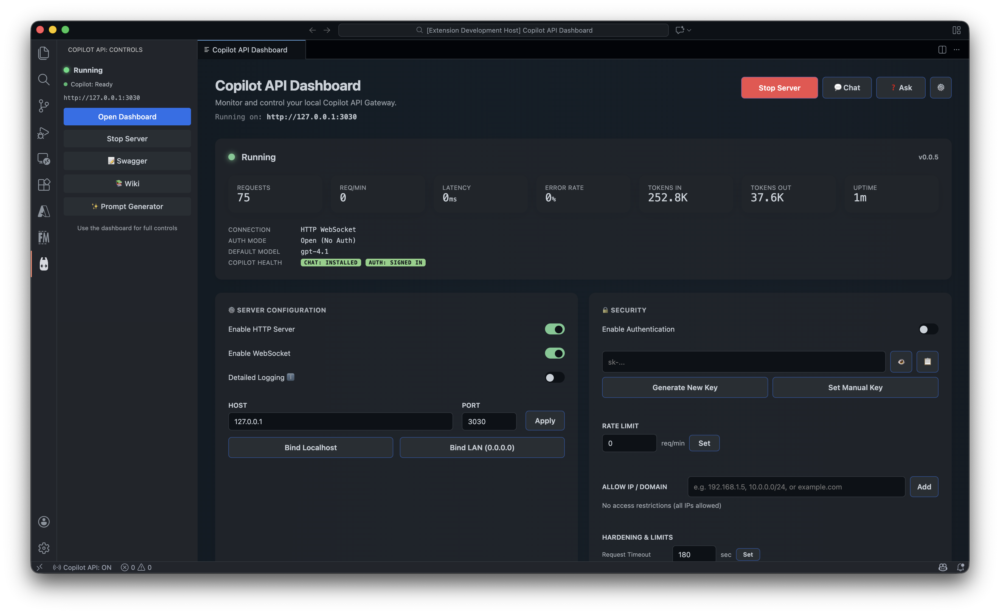

# GitHub Copilot API Gateway for VS Code

**Transform your GitHub Copilot subscription into a fully-featured, OpenAI-compatible API server.**

A production-ready VS Code extension that exposes GitHub Copilot as a local HTTP API server. Compatible with OpenAI, Anthropic Claude, and Google Gemini client libraries—connect any AI-powered application to Copilot without code changes.

[](https://code.visualstudio.com/)
[](https://opensource.org/licenses/MIT)
[](https://platform.openai.com/docs/api-reference)



---

## Overview

GitHub Copilot API Gateway creates a local HTTP server that bridges your existing Copilot subscription to any OpenAI-compatible client. This enables developers to:

- Use Copilot with third-party tools, scripts, and applications
- Integrate Copilot into custom workflows without additional API costs
- Share Copilot access across your local network securely
- Extend Copilot with Model Context Protocol (MCP) tools

**No additional API keys required.** Your existing GitHub Copilot subscription handles all requests.

---

## Key Features

### Multi-Provider API Compatibility

| Provider | Endpoint | SDK Support |
|----------|----------|-------------|
| OpenAI | `/v1/chat/completions` | Python, Node.js, Go, Rust |
| Anthropic | `/v1/messages` | Claude SDK |
| Google Gemini | `/v1beta/models/:model:generateContent` | Google AI SDK |

All endpoints support streaming, function calling, and tool use.

### Enterprise-Grade Security

- **IP Allowlisting**: Restrict access to specific IP addresses or CIDR ranges
- **Data Redaction**: Automatically mask sensitive data (API keys, credit cards, PII) in logs and prompts
- **Rate Limiting**: Configurable requests-per-minute thresholds
- **Connection Limits**: Control max concurrent requests and connections per IP
- **Bearer Token Authentication**: Optional API key protection

### Comprehensive Observability

- **Live Log Streaming**: Monitor API traffic in real-time via the dashboard
- **Full Audit Trail**: Complete request history with configurable retention
- **Interactive API Documentation**: Swagger UI available at `/docs`
- **Usage Analytics**: Track latency, token consumption, and error rates

### Model Context Protocol (MCP) Integration

Extend Copilot's capabilities with external tools:

- **File System Access**: Read, write, and list files
- **Git Operations**: Repository management and version control
- **Custom Tools**: Connect any MCP-compatible server
- **Built-in VS Code Tools**: Native integration with editor diagnostics and file operations

### Interactive Dashboard

- **Real-time Statistics**: Requests, tokens, latency, and error monitoring
- **Prompt Generator**: AI-powered tool to create detailed, actionable prompts
- **API Reference**: Code examples for Python, JavaScript, cURL, and MCP integration
- **Visual Analytics**: Charts for daily usage patterns and token consumption

---

## Installation

### Prerequisites

1. Visual Studio Code version 1.99.0 or later
2. [GitHub Copilot](https://marketplace.visualstudio.com/items?itemName=GitHub.copilot) extension installed and authenticated
3. [GitHub Copilot Chat](https://marketplace.visualstudio.com/items?itemName=GitHub.copilot-chat) extension installed

### Setup

1. Install the GitHub Copilot API Gateway extension from the VS Code Marketplace
2. Open Command Palette (`Cmd+Shift+P` / `Ctrl+Shift+P`)
3. Run **"Copilot API: Controls"** and select **"Start Server"**
4. The API server starts at `http://127.0.0.1:3030`

---

## Quick Start

### OpenAI SDK (Python)

```python
from openai import OpenAI

client = OpenAI(
    base_url="http://127.0.0.1:3030/v1",
    api_key="not-needed"
)

response = client.chat.completions.create(
    model="gpt-4o",
    messages=[{"role": "user", "content": "Hello!"}]
)
print(response.choices[0].message.content)
```

### OpenAI SDK (Node.js)

```javascript
import OpenAI from 'openai';

const openai = new OpenAI({
  baseURL: 'http://127.0.0.1:3030/v1',
  apiKey: 'not-needed'
});

const completion = await openai.chat.completions.create({
  model: 'gpt-4o',
  messages: [{ role: 'user', content: 'Hello!' }]
});
console.log(completion.choices[0].message.content);
```

### cURL

```bash
curl http://127.0.0.1:3030/v1/chat/completions \
  -H "Content-Type: application/json" \
  -d '{
    "model": "gpt-4o",
    "messages": [{"role": "user", "content": "Hello!"}]
  }'
```

---

## Framework and Tool Integrations

GitHub Copilot API Gateway is compatible with the entire OpenAI ecosystem. Any library, framework, or tool that supports the OpenAI API can connect to Copilot through this gateway.

### AI Orchestration Frameworks

| Framework | Use Case | Integration |
|-----------|----------|-------------|
| [LangChain](https://langchain.com) | Build LLM-powered applications with chains, agents, and memory | Set `base_url` to gateway endpoint |
| [LlamaIndex](https://llamaindex.ai) | Data framework for LLM applications, RAG pipelines | Configure OpenAI backend URL |
| [Haystack](https://haystack.deepset.ai) | Production-ready NLP framework | Use OpenAI generator with custom URL |
| [Semantic Kernel](https://github.com/microsoft/semantic-kernel) | Microsoft's SDK for AI orchestration | Point OpenAI connector to gateway |

### Agent Frameworks

| Framework | Description | Configuration |
|-----------|-------------|---------------|
| [AutoGPT](https://github.com/Significant-Gravitas/AutoGPT) | Autonomous AI agent | Set `OPENAI_API_BASE` environment variable |
| [CrewAI](https://crewai.com) | Multi-agent orchestration | Configure OpenAI base URL in agent settings |
| [MetaGPT](https://github.com/geekan/MetaGPT) | Multi-agent meta programming | Use custom OpenAI endpoint |
| [BabyAGI](https://github.com/yoheinakajima/babyagi) | Task-driven autonomous agent | Set OpenAI base URL |
| [SuperAGI](https://superagi.com) | Open-source AGI framework | Configure API endpoint |

### Development Tools

| Tool | Purpose | Integration Method |
|------|---------|-------------------|
| [Ollama](https://ollama.ai) | Local LLM hosting | Compatible interface; use as alternative backend |
| [LM Studio](https://lmstudio.ai) | Local model management | Same OpenAI-compatible protocol |
| [Continue](https://continue.dev) | VS Code AI coding assistant | Configure OpenAI provider URL |
| [Aider](https://aider.chat) | AI pair programming in terminal | Set `--openai-api-base` flag |
| [Open Interpreter](https://openinterpreter.com) | Natural language computer control | Configure API base URL |

### LangChain Integration Example

```python
from langchain_openai import ChatOpenAI

llm = ChatOpenAI(
    base_url="http://127.0.0.1:3030/v1",
    api_key="not-needed",
    model="gpt-4o"
)

response = llm.invoke("Explain quantum computing")
print(response.content)
```

### LangChain with Agents and Tools

```python
from langchain_openai import ChatOpenAI
from langchain.agents import create_react_agent, Tool
from langchain import hub

llm = ChatOpenAI(
    base_url="http://127.0.0.1:3030/v1",
    api_key="not-needed"
)

tools = [
    Tool(name="Search", func=search_function, description="Search the web"),
    Tool(name="Calculate", func=calculate, description="Perform math")
]

prompt = hub.pull("hwchase17/react")
agent = create_react_agent(llm, tools, prompt)
```

### LlamaIndex Integration

```python
from llama_index.llms.openai import OpenAI
from llama_index.core import VectorStoreIndex, SimpleDirectoryReader

llm = OpenAI(
    api_base="http://127.0.0.1:3030/v1",
    api_key="not-needed",
    model="gpt-4o"
)

documents = SimpleDirectoryReader("data").load_data()
index = VectorStoreIndex.from_documents(documents, llm=llm)
query_engine = index.as_query_engine()
response = query_engine.query("Summarize the documents")
```

### AutoGPT / Agent Frameworks

Set environment variables before running:

```bash
export OPENAI_API_BASE=http://127.0.0.1:3030/v1
export OPENAI_API_KEY=not-needed
```

### CrewAI Example

```python
from crewai import Agent, Task, Crew
from langchain_openai import ChatOpenAI

llm = ChatOpenAI(
    base_url="http://127.0.0.1:3030/v1",
    api_key="not-needed"
)

researcher = Agent(
    role="Researcher",
    goal="Research and analyze topics",
    llm=llm
)

task = Task(description="Research AI trends", agent=researcher)
crew = Crew(agents=[researcher], tasks=[task])
result = crew.kickoff()
```

### Building Custom Tools and Services

With the gateway running, you can build:

- **RAG Applications**: Combine with vector databases (Pinecone, Weaviate, Chroma) for retrieval-augmented generation
- **Chatbots**: Power conversational interfaces with frameworks like Rasa or Botpress
- **Code Assistants**: Build custom IDE integrations or CLI tools
- **Document Processing**: Automate analysis, summarization, and extraction
- **API Services**: Create microservices that leverage Copilot for AI capabilities
- **Automation Pipelines**: Integrate with n8n, Zapier, or custom workflows

---

## Model Context Protocol (MCP)

Connect Copilot to external tools and data sources using the [Model Context Protocol](https://modelcontextprotocol.io/).

### Configuration

Add MCP servers to your VS Code `settings.json`:

```json
"githubCopilotApi.mcp.servers": {
  "filesystem": {
    "command": "npx",
    "args": ["-y", "@modelcontextprotocol/server-filesystem", "/path/to/folder"]
  },
  "git": {
    "command": "npx",
    "args": ["-y", "@modelcontextprotocol/server-git"]
  },
  "remote": {
    "url": "http://localhost:8000/sse"
  }
}
```

### Built-in VS Code Tools

The following tools are available automatically:

| Tool | Description | Parameters |
|------|-------------|------------|
| `vscode_read_file` | Read file contents from workspace | `uri` |
| `vscode_list_files` | List files matching a pattern | `folder`, `pattern` |
| `vscode_open_file` | Open file in editor at specific lines | `uri`, `startLine`, `endLine` |
| `vscode_get_diagnostics` | Retrieve errors and warnings | `maxResults` |
| `vscode_get_active_editor` | Get content of currently open file | — |

---

## Configuration Reference

All settings are prefixed with `githubCopilotApi.`:

| Setting | Type | Default | Description |
|---------|------|---------|-------------|
| `server.enabled` | boolean | `false` | Enable or disable the API server |
| `server.autoStart` | boolean | `false` | Start server automatically when VS Code launches |
| `server.showNotifications` | boolean | `true` | Display notifications on server start |
| `server.host` | string | `127.0.0.1` | Bind address (`0.0.0.0` for LAN access) |
| `server.port` | number | `3030` | HTTP server port |
| `server.apiKey` | string | — | Optional Bearer token for authentication |
| `server.ipAllowlist` | array | `[]` | Allowed IP addresses or CIDR ranges |
| `server.redactionPatterns` | array | `[]` | Regex patterns for data masking |
| `server.rateLimitPerMinute` | number | `60` | Maximum requests per minute |
| `server.maxConcurrentRequests` | number | `4` | Maximum parallel request processing |
| `server.maxConnectionsPerIp` | number | `10` | Connection limit per client IP |
| `server.requestTimeout` | number | `120000` | Request timeout in milliseconds |
| `server.maxPayload` | number | `10485760` | Maximum request body size (bytes) |
| `mcp.enabled` | boolean | `true` | Enable Model Context Protocol |
| `audit.logRequestBodies` | boolean | `false` | Log request payloads (security consideration) |

---

## API Endpoints

| Method | Endpoint | Description |
|--------|----------|-------------|
| `POST` | `/v1/chat/completions` | OpenAI-compatible chat completions |
| `POST` | `/v1/messages` | Anthropic-compatible messages |
| `POST` | `/v1beta/models/:model:generateContent` | Google Gemini-compatible generation |
| `GET` | `/v1/models` | List available models |
| `GET` | `/docs` | Interactive Swagger UI documentation |
| `GET` | `/v1/usage` | Usage statistics |
| `WS` | `/v1/realtime` | WebSocket real-time communication |

---

## Troubleshooting

### Server Fails to Start

1. **Port conflict**: Check if port 3030 is in use with `lsof -i :3030` and change the port in settings if necessary
2. **Authentication**: Verify GitHub Copilot is signed in via the VS Code status bar
3. **Extensions**: Ensure both GitHub Copilot and GitHub Copilot Chat extensions are installed

### "Copilot Chat extension not found"

Install the GitHub Copilot Chat extension (ID: `GitHub.copilot-chat`) and restart VS Code.

### LAN Access Issues

1. Set `server.host` to `0.0.0.0` in settings
2. Verify firewall allows connections on port 3030
3. Use the IP address from the dashboard, not `localhost`

### Slow Response Times

1. First request after startup is slower (cold start)
2. Reduce `maxConcurrentRequests` if making parallel requests
3. Check network connectivity

---

## Cost Comparison

| Solution | Monthly Cost | Local Server | OpenAI SDK Compatible |
|----------|--------------|--------------|----------------------|
| **This Extension** | $10 (Copilot subscription) | Yes | Yes |
| ChatGPT Plus | $20 | No | No |
| OpenAI API | Pay-per-use | No | Yes |
| Anthropic API | Pay-per-use | No | No |

---

## Contributing

Contributions are welcome. Please submit a pull request with a clear description of your changes.

1. Fork the repository
2. Create a feature branch (`git checkout -b feature/your-feature`)
3. Commit your changes (`git commit -m 'Add your feature'`)
4. Push to the branch (`git push origin feature/your-feature`)
5. Open a Pull Request

---

## License

This project is licensed under the MIT License. See the [LICENSE](LICENSE) file for details.

---

## Disclaimer

This extension is an independent project and is not affiliated with, endorsed by, or sponsored by GitHub, Microsoft, or OpenAI. It leverages your existing GitHub Copilot subscription. Use responsibly and in accordance with GitHub's terms of service.

---

## Author

**Suhaib Bin Younis**

- Website: [suhaibbinyounis.com](https://suhaibbinyounis.com) | [suhaib.in](https://suhaib.in)
- Email: [vscode@suhaib.in](mailto:vscode@suhaib.in)
- GitHub: [@suhaibbinyounis](https://github.com/suhaibbinyounis)

---

If you find this extension useful, please consider giving it a star on GitHub.

[](https://github.com/suhaibbinyounis/github-copilot-api-vscode)
